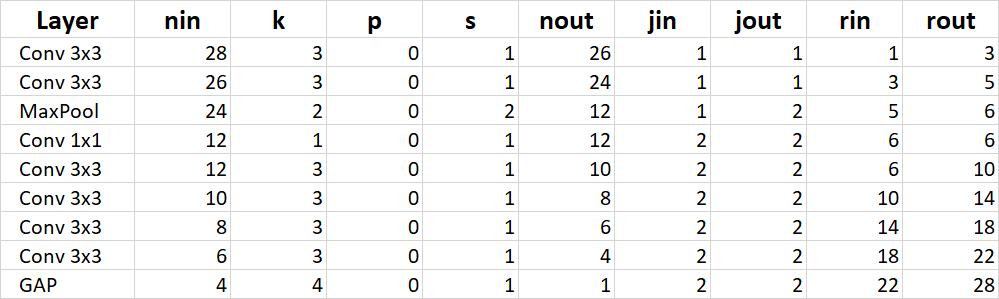
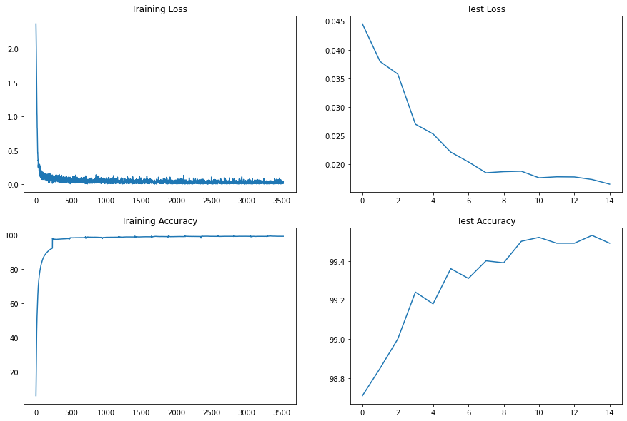
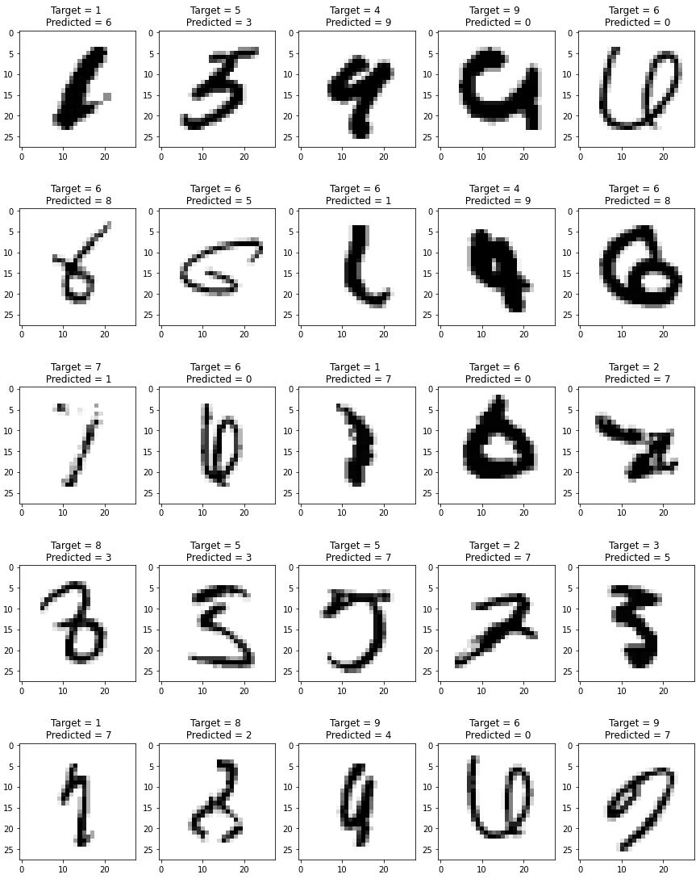

# MNIST Classification using Target, Results and Analysis Strategy

The objective is to train the model in 4 steps building a foundation and subsequently improving on it with each step. We want to achieve higher than 99.40% accuracy is less than 10,000 parameters and within 15 epochs.

The model is trained in 4 steps-

## 1. Skeleton Model
#### Target
  1. Build the model with right setup of transforms, dataloader, training and testing functions and loops.
  2. Build the skeleton of the model with less than 10,000 parameters following output size and receptive field calculations.
  3. Place the MaxPooling (RF = 5) and GlobalAveragePooling (last but one layer) at appropriate positions
  4. Print the misclassified images to analyse.

#### Result
    Parameters - 9,264
    Best Train Acc - 98.82%
    Best Test Acc - 98.76%

#### Analysis
>`1. Model is light and very slightly overfitting.`
>
>`2. Model has potential to attain more train accuracy and in turn higher test accuracy.`
>
>`3. Train accuracy is not increasing in a stable and gradual manner.`
>
>`4. We can expect model stabilization through regularization and an increase in accuracy with BatchNormalization.`
>
>`5. Misclassifed images shows that model makes basic mistakes between pairs (4,9), (5,2), (8,9). We will look to improve on this later. The general classification seems to be good for a skeleton model.`

## 2. Regularization and BatchNormalization

#### Target

1. Add dropout value of 0.1 to all the layers except the last one
2. Add BatchNormalization to all the layer except the last one

#### Result
    Parameters - 9,436 (slight increase due to BatchNormalization)
    Best Train Acc - 99.20% (Increase)
    Best Test Acc - 99.42% (Increase)

#### Analysis
> ``` 1. Regularization and BatchNormalization has resulted in stabilization of train accuracy and increase in test accuracy.```
> 
> ``` 2. Model is slightly underfitting, which means there is scope to increase the accuracy further. ```
> 
> ``` 3. Test accuracy iof 99.42% is achieved only in the last epoch.```
> 
> ``` 4. Next we apply data augmentation to train the model harder and achieve 99.42% test accuracy earlier. Analysing the misclassified shows us that some images require rotation for the model to understand the visual differences between some numbers like (7,1), (2,1) and (4,9). ```
> 
> ``` 5. We will also apply slight distortion to train model to rectify images which are harder to read otherwise. Distortion can help improve readibility of images that are difficult even for the human eye.```

## 3. Image Augmentations

### Target
1. Add rotation of (-6.0, 6.0) degrees to the dataset. Fill the void with pixel values of 33 (mean \* max pixel value = 0.1307 * 255)
2. Add slight distortion of scale 0.2 and probability of 50%.

### Result
```
Parameters - 9,436 (No change)
Best Train Acc - 98.97% (slight decrease due to augmentation)
Best Test Acc - 99.41% (No change)
```
### Analysis

>`1. Augmentation has slightly decreased the train accuracy as the training has become harder.`
>
>`2. Test accuracy of 99.41% is achieved at the 7th epoch.`
>
>`3. Test accuracy is not stable at 99.41% due to high learning rate.`
>
>`4. We will use an LR Scheduler to achieve 99.40%+ accuracy faster and consistently.`
>
>`5. We will also change the batch size from 128 to 256 to see if model trains faster.`

## 4. LR Scheduler

### Target
1. Apply LR Scheduler using Lambda LR and a multiplicative factor of 0.85 ** epoch

### Result
```
Parameters - 9,436 (No change)
Best Train Acc - 99.05% (No change)
Best Test Acc - 99.53% (Increase)
```
### Analysis 
>`1. With LR Scheduler, target accuracy of 99.40%+ is achieved at 7th epoch and stays consistently.`
>
>`2. Due to smaller learning rate in later epochs, accuracy bumps up to 99.53%.`
>
>`3. Last 3 epochs have an average accuracy of 99.50%.`
>
>`4. Changing batch size to 256 decreases the training time per epoch slightly by 1 second.`

## RF Calculations


## Model Summary
```
----------------------------------------------------------------
        Layer (type)               Output Shape         Param #
================================================================
            Conv2d-1           [-1, 12, 26, 26]             108
              ReLU-2           [-1, 12, 26, 26]               0
       BatchNorm2d-3           [-1, 12, 26, 26]              24
           Dropout-4           [-1, 12, 26, 26]               0
            Conv2d-5           [-1, 14, 24, 24]           1,512
              ReLU-6           [-1, 14, 24, 24]               0
       BatchNorm2d-7           [-1, 14, 24, 24]              28
         MaxPool2d-8           [-1, 14, 12, 12]               0
            Conv2d-9           [-1, 10, 12, 12]             140
           Conv2d-10           [-1, 14, 10, 10]           1,260
             ReLU-11           [-1, 14, 10, 10]               0
      BatchNorm2d-12           [-1, 14, 10, 10]              28
          Dropout-13           [-1, 14, 10, 10]               0
           Conv2d-14             [-1, 14, 8, 8]           1,764
             ReLU-15             [-1, 14, 8, 8]               0
      BatchNorm2d-16             [-1, 14, 8, 8]              28
          Dropout-17             [-1, 14, 8, 8]               0
           Conv2d-18             [-1, 16, 6, 6]           2,016
             ReLU-19             [-1, 16, 6, 6]               0
      BatchNorm2d-20             [-1, 16, 6, 6]              32
          Dropout-21             [-1, 16, 6, 6]               0
           Conv2d-22             [-1, 16, 4, 4]           2,304
             ReLU-23             [-1, 16, 4, 4]               0
      BatchNorm2d-24             [-1, 16, 4, 4]              32
          Dropout-25             [-1, 16, 4, 4]               0
        AvgPool2d-26             [-1, 16, 1, 1]               0
           Conv2d-27             [-1, 10, 1, 1]             160
================================================================
Total params: 9,436
Trainable params: 9,436
Non-trainable params: 0
----------------------------------------------------------------
Input size (MB): 0.00
Forward/backward pass size (MB): 0.55
Params size (MB): 0.04
Estimated Total Size (MB): 0.59
----------------------------------------------------------------
```

## Training Logs
```
EPOCH: 0
Loss=0.014656812883913517 Batch_id=234 Accuracy=92.17: 100%|██████████| 235/235 [00:19<00:00, 11.79it/s]
Test set: Average loss: 0.0445, Accuracy: 9871/10000 (98.71%)

EPOCH: 1
Loss=0.013492856174707413 Batch_id=234 Accuracy=97.76: 100%|██████████| 235/235 [00:19<00:00, 11.85it/s]
Test set: Average loss: 0.0379, Accuracy: 9885/10000 (98.85%)

EPOCH: 2
Loss=0.010001967661082745 Batch_id=234 Accuracy=98.31: 100%|██████████| 235/235 [00:20<00:00, 11.71it/s]
Test set: Average loss: 0.0357, Accuracy: 9900/10000 (99.00%)

EPOCH: 3
Loss=0.09162674099206924 Batch_id=234 Accuracy=98.46: 100%|██████████| 235/235 [00:20<00:00, 11.66it/s]
Test set: Average loss: 0.0270, Accuracy: 9924/10000 (99.24%)

EPOCH: 4
Loss=0.03818586468696594 Batch_id=234 Accuracy=98.59: 100%|██████████| 235/235 [00:20<00:00, 11.73it/s]
Test set: Average loss: 0.0253, Accuracy: 9918/10000 (99.18%)

EPOCH: 5
Loss=0.02528129331767559 Batch_id=234 Accuracy=98.72: 100%|██████████| 235/235 [00:20<00:00, 11.74it/s]
Test set: Average loss: 0.0221, Accuracy: 9936/10000 (99.36%)

EPOCH: 6
Loss=0.014623264782130718 Batch_id=234 Accuracy=98.81: 100%|██████████| 235/235 [00:19<00:00, 11.76it/s]
Test set: Average loss: 0.0204, Accuracy: 9931/10000 (99.31%)

EPOCH: 7
Loss=0.03523479774594307 Batch_id=234 Accuracy=98.90: 100%|██████████| 235/235 [00:19<00:00, 11.93it/s]
Test set: Average loss: 0.0185, Accuracy: 9940/10000 (99.40%)

EPOCH: 8
Loss=0.04007599875330925 Batch_id=234 Accuracy=98.93: 100%|██████████| 235/235 [00:19<00:00, 11.85it/s]
Test set: Average loss: 0.0187, Accuracy: 9939/10000 (99.39%)

EPOCH: 9
Loss=0.008310316130518913 Batch_id=234 Accuracy=98.97: 100%|██████████| 235/235 [00:19<00:00, 11.79it/s]
Test set: Average loss: 0.0188, Accuracy: 9950/10000 (99.50%)

EPOCH: 10
Loss=0.004331173840910196 Batch_id=234 Accuracy=99.05: 100%|██████████| 235/235 [00:20<00:00, 11.73it/s]
Test set: Average loss: 0.0177, Accuracy: 9952/10000 (99.52%)

EPOCH: 11
Loss=0.038199618458747864 Batch_id=234 Accuracy=99.07: 100%|██████████| 235/235 [00:20<00:00, 11.73it/s]
Test set: Average loss: 0.0178, Accuracy: 9949/10000 (99.49%)

EPOCH: 12
Loss=0.06656255573034286 Batch_id=234 Accuracy=99.08: 100%|██████████| 235/235 [00:20<00:00, 11.59it/s]
Test set: Average loss: 0.0178, Accuracy: 9949/10000 (99.49%)

EPOCH: 13
Loss=0.002775030443444848 Batch_id=234 Accuracy=99.07: 100%|██████████| 235/235 [00:19<00:00, 11.77it/s]
Test set: Average loss: 0.0174, Accuracy: 9953/10000 (99.53%)

EPOCH: 14
Loss=0.0334785170853138 Batch_id=234 Accuracy=99.10: 100%|██████████| 235/235 [00:20<00:00, 11.69it/s]
Test set: Average loss: 0.0165, Accuracy: 9949/10000 (99.49%)
```
## Training Graphs


## Sample of Misclassified Images

