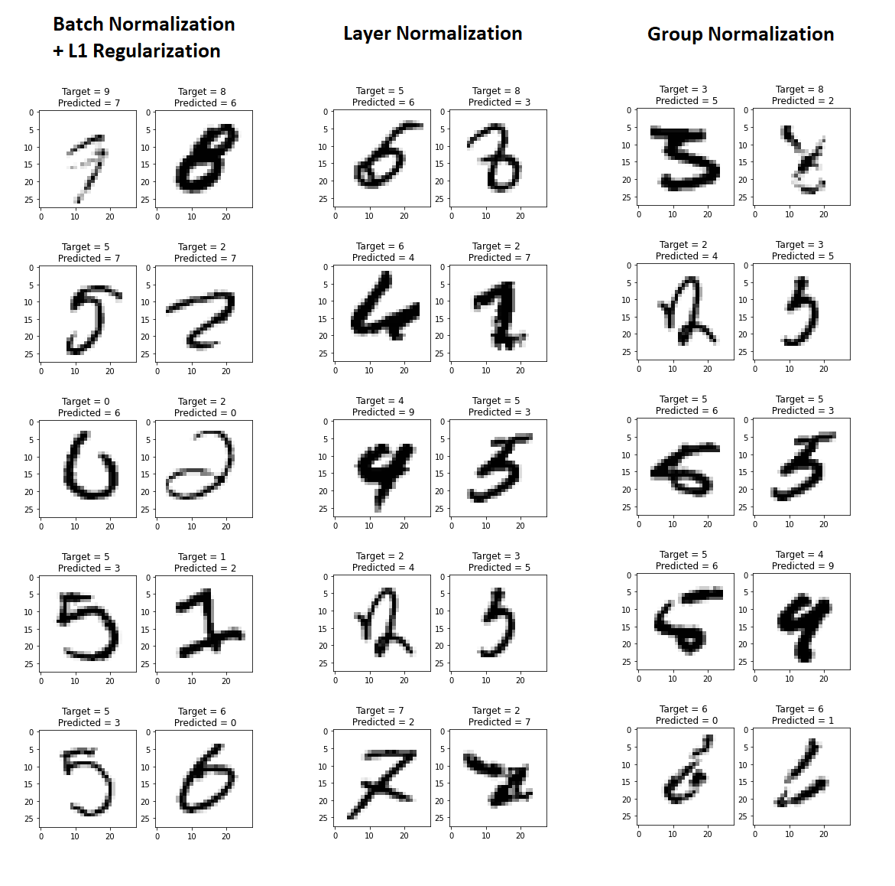
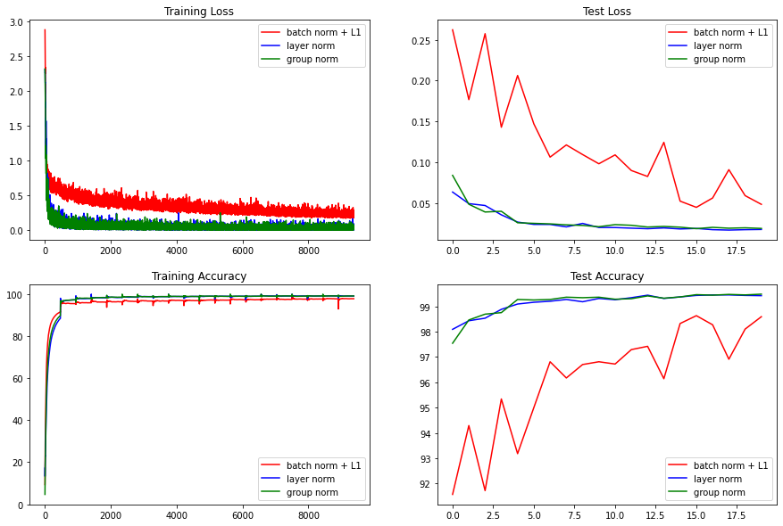
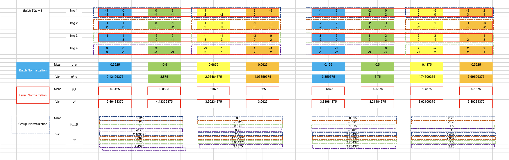

# Batch Normalization and Regularization
The goal here is to understand various batch normalization techniques on a neural network using the mnist dataset.

- Network with L1 + BN
- Network with Layer Normalization
- Network with Group Normalization

## File Structure
.
+-- Batch_Normalization_and_Regularization.ipynb
+-- models
|   +-- model.py
+-- utils
|   +-- train.py
|   +-- test.py
+-- plots
|   +-- plot.py

## Network Used
Below is the network we have used as a baseline.

```
  ----------------------------------------------------------------
          Layer (type)               Output Shape         Param #
  ================================================================
              Conv2d-1           [-1, 10, 26, 26]              90
                ReLU-2           [-1, 10, 26, 26]               0
           GroupNorm-3           [-1, 10, 26, 26]              20
             Dropout-4           [-1, 10, 26, 26]               0
              Conv2d-5           [-1, 20, 24, 24]           1,800
                ReLU-6           [-1, 20, 24, 24]               0
           GroupNorm-7           [-1, 20, 24, 24]              40
              Conv2d-8           [-1, 10, 24, 24]             200
           MaxPool2d-9           [-1, 10, 12, 12]               0
             Conv2d-10           [-1, 20, 10, 10]           1,800
               ReLU-11           [-1, 20, 10, 10]               0
          GroupNorm-12           [-1, 20, 10, 10]              40
            Dropout-13           [-1, 20, 10, 10]               0
             Conv2d-14             [-1, 12, 8, 8]           2,160
               ReLU-15             [-1, 12, 8, 8]               0
          GroupNorm-16             [-1, 12, 8, 8]              24
             Conv2d-17             [-1, 12, 6, 6]           1,296
               ReLU-18             [-1, 12, 6, 6]               0
          GroupNorm-19             [-1, 12, 6, 6]              24
            Dropout-20             [-1, 12, 6, 6]               0
          AvgPool2d-21             [-1, 12, 1, 1]               0
             Conv2d-22             [-1, 10, 1, 1]             120
  ================================================================

```

## Batch Normalization Used
Defined  a batch normalization function that takes in batch normalization type (bn_type) and channels.

- Group Normalization - splitting into 2 groups
- Layer Normalization - Using GroupNorm function but using one group
- Batch Normalization - Using the usual nn.BatchNorm2d

```python
  def batch_norm(bn_type,channels):
    if bn_type == 'GN':
      return nn.GroupNorm(2,channels)
    elif bn_type == 'LN':
      return nn.GroupNorm(1,channels)
    elif bn_type == 'BN':
      return nn.BatchNorm2d(channels)
```

Modified the class to take 1 parameter batch normalization type(bn_type)

```python
  class Net(nn.Module):
      def __init__(self,bn_type):
          super(Net, self).__init__()

          self.bn_type = bn_type
          self.dropout = dropout_value
          
          # Input Block
          self.convblock1 = nn.Sequential(
              nn.Conv2d(in_channels=1, out_channels=10, kernel_size=(3, 3), padding=0, bias=False),
              nn.ReLU(),
              batch_norm(self.bn_type,10),
              nn.Dropout(self.dropout)
          ) # output_size = 26

          # CONVOLUTION BLOCK 1
          self.convblock2 = nn.Sequential(
              nn.Conv2d(in_channels=10, out_channels=20, kernel_size=(3, 3), padding=0, bias=False),
              nn.ReLU(),
              batch_norm(self.bn_type,20),
              #nn.Dropout(self.dropout)
          ) # output_size = 24

          # TRANSITION BLOCK 1
          self.convblock3 = nn.Sequential(
              nn.Conv2d(in_channels=20, out_channels=10, kernel_size=(1, 1), padding=0, bias=False),
          ) # output_size = 24
          self.pool1 = nn.MaxPool2d(2, 2) 

          # CONVOLUTION BLOCK 2
          self.convblock4 = nn.Sequential(
              nn.Conv2d(in_channels=10, out_channels=20, kernel_size=(3, 3), padding=0, bias=False),
              nn.ReLU(),            
              batch_norm(self.bn_type,20),
              nn.Dropout(self.dropout)
          ) # output_size = 10
          
          self.convblock5 = nn.Sequential(
              nn.Conv2d(in_channels=20, out_channels=12, kernel_size=(3, 3), padding=0, bias=False),
              nn.ReLU(),            
              batch_norm(self.bn_type,12),
              #nn.Dropout(self.dropout)
          ) # output_size = 8
          
          self.convblock6 = nn.Sequential(
              nn.Conv2d(in_channels=12, out_channels=12, kernel_size=(3, 3), padding=0, bias=False),
              nn.ReLU(),            
              batch_norm(self.bn_type,12),
              nn.Dropout(self.dropout)
          ) # output_size = 6
          
          self.convblock7 = nn.Sequential(
              nn.Conv2d(in_channels=16, out_channels=16, kernel_size=(3, 3), padding=1, bias=False),
              nn.ReLU(),            
              batch_norm(self.bn_type,16),
              nn.Dropout(self.dropout)
          ) # output_size = 6

          # OUTPUT BLOCK
          self.gap = nn.Sequential(
              nn.AvgPool2d(kernel_size=6)
          ) # output_size = 1

          self.convblock8 = nn.Sequential(
              nn.Conv2d(in_channels=12, out_channels=10, kernel_size=(1, 1), padding=0, bias=False),
              # nn.BatchNorm2d(10),
              # nn.ReLU(),
              # nn.Dropout(self.dropout)
          ) 

      def forward(self, x):
          x = self.convblock1(x)
          x = self.convblock2(x)
          x = self.convblock3(x)
          x = self.pool1(x)
          x = self.convblock4(x)
          x = self.convblock5(x)
          x = self.convblock6(x)
          #x = self.convblock7(x)
          x = self.gap(x)        
          x = self.convblock8(x)

          x = x.view(-1, 10)
          return F.log_softmax(x, dim=-1)
```

## Incorporating L1 regularization
Incorporated the below as a configurable loss with flag l1_reg
  ```python
    # Calculate loss
        if l1_reg:
          L1_reg = torch.tensor(0., requires_grad=True)
          for name, param in model.named_parameters():
            if 'weight' in name:
              L1_reg = L1_reg + torch.norm(param, 1)

          loss = F.nll_loss(y_pred, target) + 10e-4 * L1_reg  
        else :  
          loss = F.nll_loss(y_pred, target)
  ```

## Misclassified Images 


## Results:


## Normalization Calculations for 4 channel images


## Analysis:
- Using L1 with batch normalization reduced the achieved accuracy compared to batch normalization alone (~ 1.5 % reduction). Maybe because L1 is forcing to use spare parameters. The model was underfitting too. Training accuracy was only ~97.49.
- Learning was more uneven in while using batch normalization + L1
- Layer and group normalization gve similar results compareed to Batch normalization + L1
- Batch normalization + L1
  - training accuracy : 97.83
  - test accuracy : 98.63
- Layer normalization
  - training accuracy : 99.16
  - test accuracy : 99.45
- Group normalization
  - training accuracy : 99.16
  - test accuracy : 99.48
